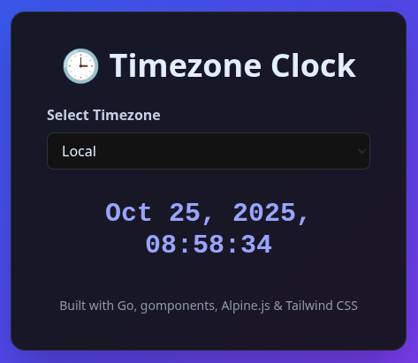

# Golang Skeleton Clock Service with DEB package deployment for Beginners

This is a very simple golang service that can run on a headless server. It's designed to be very simple so you can understand/edit the code in a few minutes, yet at the same time very powerful and fully featured including source archiving, packaging, deployment, and automatic rollbacks. This includes building, archiving, packaging (into deb packages), and running on a debian/ubuntu arm or amd server.

This is an excellent fully running scaffolding / skeleton to build your own golang application on.

- Includes full testing coverage to build upon.
- To make your own binary, copy /cmd/clock to /cmd/\<some name\>, update version.go, edit to your liking, and use \<some name\> instead of 'clock' in the instructions below.
- Use `go mod tidy` in the root folder to cleanup/add dependencies.
- Recommend using Visual Studio Code (free) for golang development. This automatically formats and updates imports.
  - Suggested extensions: Go (Go Team at Google), Tidy Markdown Formatter (Christian K Laustsen), Prettier - Code formatter (Prettier), markdownlint (David Anson), Gemini Code Assist (Google), favorites (Howard.Zuo), 
- Creates a debian package that run on both arm64 and amd64 (Works on Oracle ARM free-tier, Google Cloud, Vultr, etc)
  - It builds both binaries and packages them together with a run wrapper for selecting the architecture.
  - Service files are placed in `/opt/clock/`, and ticker caching (per hour) is stored in `/opt/clock/data`.
    - Name clock is customizable by editing the version.go file.
    - Creates a separate user of the same name as the binary for running the job (security)
    - Configures logrotate and systemd which are files placed in /etc
    - `apt-get --purge remove clock` will remove all files related to this package, including the data/cache and logs, as if the package was never installed.
- Creates a source archive that is within the deb package in `/opt/clock/src` for understanding what code is running on the server.
- Has versioning in a golang file that the build scripts use so the main file can also know it's version.
- Creates the necessary ufw, systemd, logrotate files to make the service automatically start and reload.
- Uses systemd watchdog to ensure the service doesn't get stuck.
- Uses a separate health check port for verifying installation was successful.
- The log files will be viewed at `tail -f /var/log/clock.log`
- The systemd log for clock can be read by: `journalctl -u clock` or tailed by adding `-f`
- This service runs on port 8080 for all interfaces by default. This can be configured in the build.sh file.
- The `build.sh` is located in the `cmd/clock` folder because the root hierarchy could be used by multiple golang services in your `cmd/proxy`,`cmd/clock`,`cmd/auth` system that each would likely have unique build.sh needs.
- For shared libraries across services, put them in `internal/<package>/<go files>`
- If you want to make this a ***distributed service***, you will need to have a shared source of truth, such as etcd, to store a list of hosts that are running this package, a way for clients to read this file, and finally extend deployment to add/remove the service from list on apt-get remove (removal), safe-dpkg (install). The existing /healthz endpoint in the basic example has a busyness field that can be updated and used for load balancing and growing/shrinking your tasks. I recommend busyness=1.0 as being near full load.

# Screenshots of the service running:



# Instructions

## Run locally

go run ./cmd/clock

## Install on cloud/remote SSH machine

``` bash
SERVER=myfqdn or IP address

./cmd/clock/build.sh && scp -r cmd/clock/clock_1.0.0.deb ${SERVER?}: && 
ssh ${SERVER?} "sudo bash -c 'apt-get -y remove clock ; dpkg -i clock_1.0.0.deb || apt-get install -f'"
```

- We call `apt-get install -f` at the end to get any missing deb dependencies.

## If you want a simpler and rollback safe dpkg installation:

- First configure SERVER and NAME in the environment for your package and server host:

``` bash
NAME=clock
VERSION=1.0.33
SERVER=myfqdn or IP address
```

- Next (if not yet done), copy tools/safe-dpkg on your service host server to /usr/local/bin


``` bash
scp tools/safe-dpkg ${SERVER?}:
ssh ${SERVER?} "sudo bash -c 'chown root:root safe-dpkg && chmod 755 safe-dpkg && mv safe-dpkg /usr/local/bin/safe-dpkg'"
```

- Next, call `safe-dpkg clock_1.0.0.deb` instead of multiple apt-get and dpkg calls. This will also safely roll back to the previous good running package on install/health failure (even if it has the same version name).

  - This will store a copy of the deb file in `/var/cache/safe-dpkg` only if it's successful in installation and healthy.
  - During install, it will uninstall the old package if needed prior to installing.
  - On failure, it rolls back to the newest deb file in `/var/cache/safe-dpkg`.
  - On dependency issues, it will automatically install the dependencies.

Build, Copy over, Deploy
``` bash
./cmd/${NAME//-/_}/build.sh && scp -r cmd/${NAME//-/_}/${NAME}_${VERSION?}.deb ${SERVER?}: && ssh -tt ${SERVER?} "sudo bash -c 'safe-dpkg ${NAME}_${VERSION?}.deb'"
```

## Debugging Tips

- Note: We create a directory /opt/$NAME/data that's owned by $USER for caching/storing data. `apt-get --purge remove $NAME` will delete these files.
- Systemd logs are: `journalctl -u $NAME -f`
- Service logs are: `tail -f /var/log/$NAME.log`
- `ps -ef |grep (port num)` will tell you if the job is running on that port. Since the packaged binary runs with port arguments --port=XX --health_port=YY, this avoids needing complicated things like lsof/ss/netstat/nmap
- To manually do operations as the user, you can run `sudo su -s /bin/bash "${USER}"`. This is needed because the shell is nologin in the password file.
